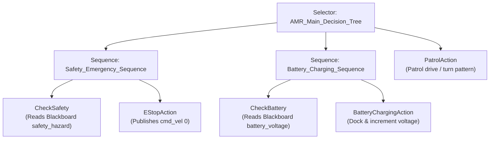

# ROS2 Autonomy & Behavior Trees Workspace (pytrees) 🤖🌲

A comprehensive, production-grade ROS2 Humble workspace implementing multiple autonomous mobile robot (AMR) control systems, Gazebo simulations, and safety-critical **Behavior Tree** & **State Machine** architectures.

---

## 📦 Packages Directory

This workspace contains the following ROS2 packages under the `src/` directory:

### 1. [AMR Forklift Simulation & Autonomy (amr_forklift)](./src/amr_forklift)
The primary simulation and autonomy package for the **Nebula Forklift AMR**.
*   **Autonomy Behavior Tree**: Implemented with `py_trees` to monitor battery charge, run automated docking/charging states, and execute emergency halts (E-Stop).
*   **Physics Simulation**: Physics-calibrated differential AMR with a functional prismatic forklift fork mechanism (`lift_joint`) and parameterized passive rollers.
*   **Interactive Simulation**: Supports manual topic publishing to trigger E-Stop or low battery events.

### 2. [Robot Behavior Tree Executor (robot_bt)](./src/robot_bt)
A clean, modular executor package designed for general AMR tasks.
*   **Action Server**: Implements a custom action interface `CleanArea.action` for cleaning tasks.
*   **Telemetry Node**: Contains publishers for simulated distance sensors, battery states, cmd_vel rates, and log managers.

### 3. [Turtle Tasks Nav2 Executor (turtle_tasks)](./src/turtle_tasks)
An execution package managing autonomous navigation for a differential drive AMR.
*   **Nav2 Tuning**: Hosts optimized Navigation2 parameter configurations (`nav2_params_optimized.yaml`) for tight trajectory planning.
*   **Mission Executor**: Executes patrol cycles using py_trees node wrappers.

### 4. [Turtlebot Autonomy State Machine (turtlebot_autonomy)](./src/turtlebot_autonomy)
An alternative autonomy architecture built using the **SMACH** state machine framework.
*   Defines structured states (Devriye, Standby, Goal Reached) and manages state transitions based on sensor feedback.

### 5. [Autonomy Tutorials (SimpleExamplesForBehaviorTree)](./src/SimpleExamplesForBehaviorTree)
A collection of 101-level examples designed to teach the fundamentals of:
*   `behaviortree_101` (C++ Behavior Trees)
*   `pytree_101` (Python PyTrees)
*   `smach_101` (Python SMACH State Machines)

---

## 📐 Decision Making Flow (AMR Forklift Example)

Below is the behavior tree logic executing inside the `amr_forklift` package to coordinate safety, power states, and patrol missions:



---

## ⚙️ Compilation & Quick Start

Ensure ROS2 Humble is sourced on your Ubuntu terminal, then clone and compile the workspace:

```bash
# 1. Navigate to workspace root
cd /home/furkan/Desktop/CV_LER/pytrees

# 2. Build all packages
colcon build --symlink-install

# 3. Source the workspace
source install/setup.bash
```

### Run Forklift AMR Simulation:
```bash
# Terminal 1: Launch Gazebo and spawn Nebula AMR
ros2 launch amr_forklift gazebo.launch.py

# Terminal 2: Start Behavior Tree decision node
ros2 launch amr_forklift behaviors.launch.py
```
*For detailed usage and testing guides of other packages, navigate to their individual directories.*
