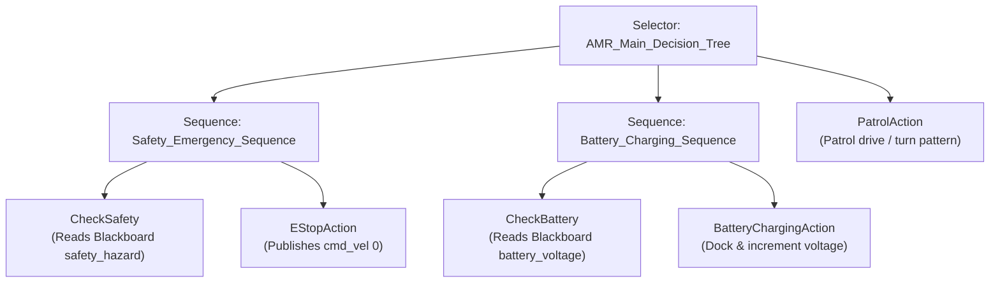

# AMR Forklift Autonomy & Gazebo Simulation 🤖🚜

An industry-grade, production-ready **ROS2 Humble** simulation and robot autonomy package designed for the **Nebula Forklift AMR** (Autonomous Mobile Robot). 

This repository showcases high-fidelity Gazebo physics simulation, custom forklift kinematic configurations, and a safety-critical **Behavior Tree** architecture built with the `py_trees` framework.

---

## 📐 Behavior Tree Decision Architecture

The AMR's high-level mission and safety overrides are managed via a modular Behavior Tree. The system continuously evaluates safety states and battery levels before defaulting to the patrol task:



---

## 🛠️ Features

* **Forklift AMR URDF Model**: Differentially driven mobile base equipped with a custom-engineered lifting mast and carriage fork utilising a prismatic joint (`lift_joint`). Includes sensor locations for LIDAR and IMU.
* **Physics World (Nebula Arena)**: Simulated environment featuring pathways, obstacles, and navigation corridors to benchmark mapping, localization (SLAM), and navigation.
* **Autonomy Behavior Tree Node (`amr_behavior_tree`)**:
  * **Emergency Stop (E-Stop)**: Subscribes to `/safety_hazard` (triggered by high temperature or gas sensors). Cuts power to motor controllers instantly.
  * **Automatic Battery Docking**: Subscribes to `/battery_voltage`. If voltage drops below `11.0V`, the AMR suspends patrol, navigates to a charging dock, and triggers simulated charging until voltage recovers to `14.2V`.
  * **Patrol Mission**: Drives the robot through devriye patterns (alternating straight-line travel and angular turns) by publishing to `/cmd_vel`.
* **PlayAudio Action Interface**: Built-in `.action` interface structure (`PlayAudio.action`) enabling the robot to request speech/alarm outputs during E-Stop or docking phases.

---

## 📂 Repository Layout

```
amr_forklift/
├── package.xml            # Package dependencies (rclpy, py_trees, etc.)
├── CMakeLists.txt         # Build instructions and Action interface compiling
├── action/
│   └── PlayAudio.action   # Robot voice/sound action definition
├── launch/
│   ├── gazebo.launch.py   # Spawns the AMR, runs Gazebo server/client, and loads RViz2
│   └── behaviors.launch.py# Runs the Behavior Tree autonomy node
├── worlds/
│   └── nebula_arena.world # Gazebo world grid
├── models/
│   └── nebula_urdf/       # AMR URDF configuration, properties, and Gazebo controllers
├── rviz/
│   └── config.rviz        # Predefined RViz layout and configuration
└── amr_forklift/
    ├── __init__.py
    └── amr_behavior_tree.py# Autonomy logic implementing Blackboard and py_trees loop
```

---

## ⚙️ How to Build & Run

### 1. Compile the Package
Clone this repository into the `src` folder of your ROS2 workspace, then build:
```bash
cd <your_ros2_ws_root>
colcon build --packages-select amr_forklift --symlink-install
source install/setup.bash
```

### 2. Launch the Gazebo Arena Simulation
Launches the simulator, spawns the Nebula Forklift AMR at starting coordinates, and boots RViz2:
```bash
ros2 launch amr_forklift gazebo.launch.py
```

### 3. Start the Behavior Tree Autonomy
Start the decision-making loop:
```bash
ros2 launch amr_forklift behaviors.launch.py
```

---

## 🧪 Testing Autonomy (Manual Topic Publishing)

To test the reactive behavior of the Behavior Tree, open a new terminal and publish simulated sensor readings:

### ⚠️ Trigger E-Stop (Safety Hazard)
Simulate a gas leak or high-temperature event. The robot will halt instantly:
```bash
ros2 topic pub /safety_hazard std_msgs/Bool "{data: true}" -1
```
*To reset and resume normal operations:*
```bash
ros2 topic pub /safety_hazard std_msgs/Bool "{data: false}" -1
```

### 🔋 Trigger Low Battery (Charging Mode)
Simulate a battery drain. The robot will stop, enter charging mode, and print its voltage incrementing in real-time until it is fully charged:
```bash
ros2 topic pub /battery_voltage std_msgs/Float32 "{data: 10.5}" -1
```
